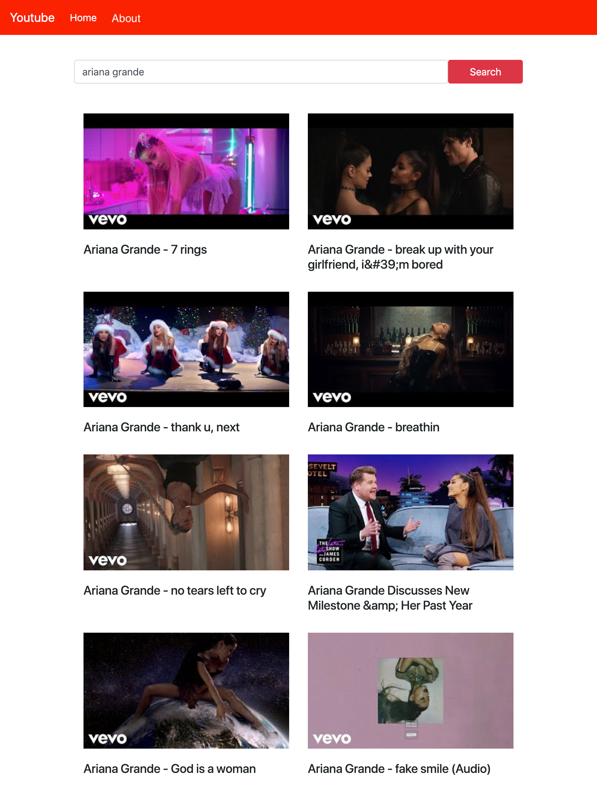

# Team 5 YouTube Clone Project

## About this Project

YouTube Clone application that lets you search for YouTube videos using the YouTube API, then choose a video from a list to watch. For this project, we collaborated to recreate components similar to the YouTube application.

## Team Members

- Eric Cave
- Hulkaroy Jouraboeva (Team Lead)
- Stephanie Lucano
- Triane Peart

## Project Workflow

[Trello](https://trello.com/b/yNG0Heo0)

[Miro](https://miro.com/app/board/uXjVOd8J-Tk=/)

YouTube Clone

## Used Resources

We used the following resources to create our code:

- [`create-react-app`](https://www.npmjs.com/package/create-react-app)
- [`react-router-dom`](https://www.npmjs.com/package/react-router-dom)
- [`youtube-react`](https://www.npmjs.com/package/youtube-react)
- [Getting and Implementing your YouTube API Key](./docs/youtube-api-key.md)